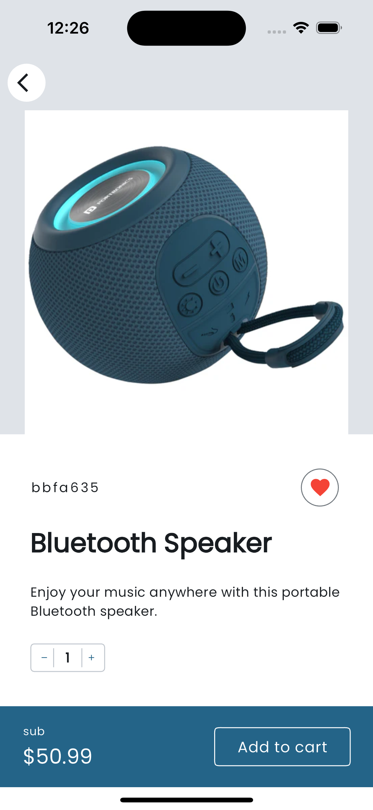

# HNG Task 3

## Sharrie’s Signature

## Description

A simple shopping app that displays a list of products/items fetched from the Timu API and includes a checkout screen.

## Commit Convention

Conventional Commits is a specification for adding human and machine-readable meaning to commit messages. The format is:

```bash
<type>[optional scope]: <description>

[optional body]

[optional footer(s)]
```

### Types

- feat: A new feature
- fix: A bug fix
- docs: Documentation only changes
- style: Changes that do not affect the meaning of the code
- refactor: A code change that neither fixes a bug nor adds a feature
- perf: A code change that improves performance
- test: Adding missing tests or correcting existing tests
- build: Changes that affect the build system or external dependencies
- ci: Changes to our CI configuration files and scripts
- chore: Other changes that don't modify src or test files
- revert: Reverts a previous commit
...

## Objectives

- Create a pixel-perfect shopping app based on the Timbu Shop designs.
- Products screen shows a list of products/items.
- Checkout screen displays the products added for checkout.
- Functionality to add and remove items from the checkout.
- A button to navigate to an "Order Successful" screen from the checkout screen.
- Proper UI state management and error handling.

## Acceptance Criteria

- **No Third-party Dependencies**: Built without importing any third-party packages, plugins, or libraries. Only native functionalities and components are used.
- **Intuitive and Adaptive UI**: User-friendly and intuitive interface, with clear labeling, easy navigation, and proper spacing.
- **Proper README File**: Contains setup instructions, app screenshots, apk download link, etc.

## Screenshots

| Products Screen                                                                 | Product Detail Screen                                                             | Checkout  Screen                                                                  | Order Successful Screen                                                           |
|---------------------------------------------------------------------------------|----------------------------------------------------------------------------------|----------------------------------------------------------------------------------|-----------------------------------------------------------------------------------|
|                              |                    |                               |                |

## Setup Instructions

1. Clone the repository:

    ```sh
    git clone https://github.com/MrKhay/sharrie_signature_hng_task_3.git
    cd sharrie_signature_hng_task_3
    ```

2. Open the project in your chosen development environment (e.g., Android Studio for Android, Xcode for iOS).

3. Build and run the app on an emulator or physical device.

## Figman Design Link

View design [here](https://www.figma.com/design/clF99fTP4N8Brmt0PtPz5C/HNG-Internship-projects?node-id=19-3&t=aafjHDWLeTo6Ua7I-0).

## APK Download

Download the APK file from [here](https://github.com/MrKhay/sharrie_signature_hng_task_3/releases/tag/v1.0.2).

## Appetize.io Showcase

Check out the virtualized demonstration of the app on [Appetize.io](https://appetize.io/app/b_4ktr6tmpx45sz45vausfolxdmm).

## Contact

For any questions or issues, please contact [MrKhay](https://x.com/iKhayDev).

## License

This project is licensed under the MIT License - see the [LICENSE](LICENSE) file for details.
